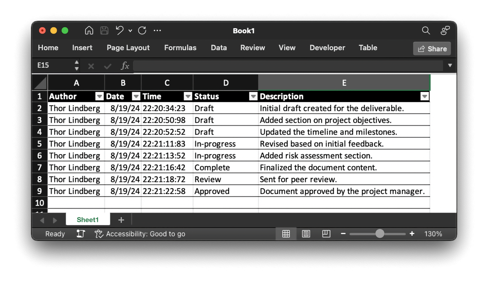

# Changelog in Excel

`Worksheet_Change()` handler for automatically registrering author, date, and time in a changelog sheet.

## Adding to VBAProject

These are the steps to add the code from `/Microsoft Excel Objects/Sheet.txt` in Excel.

1. Open the VBA Editor in `Developer > Visual Basic`
2. Open the code editor for the sheet in `VBAProject > Microsoft Excel Objects > Sheet`
    - `Sheet` will be the name you have given the sheet or a default sheet name
3. Paste in the code from `/Microsoft Excel Objects/Sheet.txt`
4. Close the VBA editor

## Configuration

| Description                                              | Code                               | Default value |
| -------------------------------------------------------- | ---------------------------------- | ------------- |
| Number of the column where author will be inserted       | `Const AuthorColumn As Integer = ` | `1`           |
| Number of the column where current date will be inserted | `Const DateColumn As Integer = `   | `2`           |
| Number of the column where time stamp will be inserted   | `Const TimeColumn As Integer = `   | `3`           |